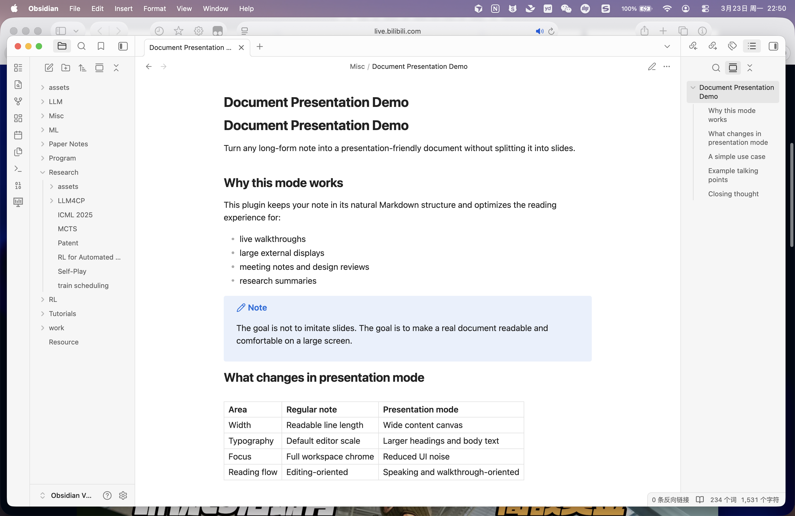
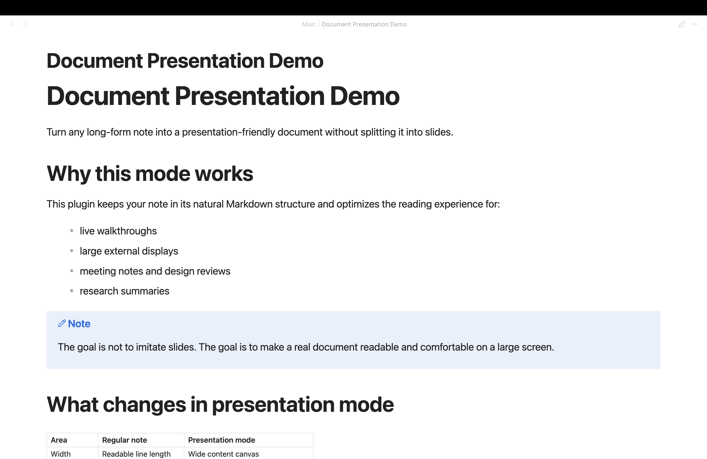
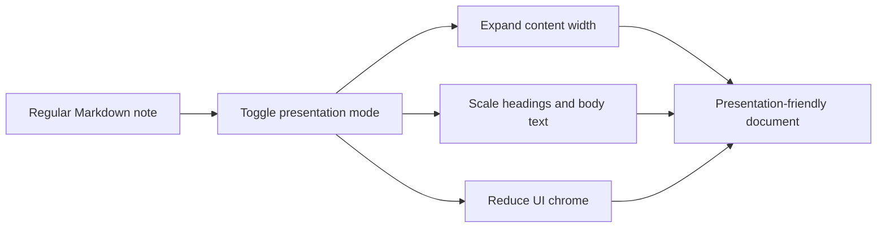

# Document Presentation Mode

Present a regular Obsidian note as a wide, fullscreen, document-style canvas.

Instead of converting Markdown into slides, Document Presentation Mode keeps your note intact and optimizes the layout for walkthroughs, demos, reviews, and large-screen reading.

## Why this plugin exists

Some notes are meant to be explained, not redesigned.

When a long-form note is shown on a monitor or projector, the default reading layout often feels too narrow and too editor-oriented. This plugin turns the current note into a presentation-friendly document by widening the content area, increasing typography scale, and hiding surrounding UI noise.

## At a glance

- Keep one continuous Markdown document
- Expand the reading width for large displays
- Increase heading and body text scale
- Hide sidebars, tab headers, and status bar while presenting
- Preview the same layout without entering fullscreen

## Visual comparison

| Regular note | Presentation mode |
| --- | --- |
|  |  |

## How it works



## What changes in presentation mode

| Area | Default reading experience | Presentation mode |
| --- | --- | --- |
| Structure | Standard note layout | Same note, unchanged content |
| Width | Readable-line-length style column | Wide document canvas |
| Typography | Default note scale | Larger headings and body text |
| Focus | Full workspace chrome | Reduced UI distractions |
| Usage | Editing and browsing | Presenting and live walkthroughs |

## Commands

- `Enter document presentation fullscreen`
- `Toggle document presentation layout`
- `Exit document presentation`

## Settings

- `Reading view only`
- `Auto-enter reading view`
- `Content width (%)`
- `Base font size (px)`
- `Line height`
- `Title scale`
- `Horizontal padding (px)`
- `Center content`
- `Hide sidebars`
- `Hide status bar`
- `Hide tab header`

## Typical use cases

- Research note walkthroughs
- Design review documents
- Meeting agendas and decision logs
- Product demos based on Markdown notes
- Teaching or speaking from a single note instead of slides

## Installation for development

1. Clone this repository.
2. Run `npm install`.
3. Run `npm run build`.
4. Copy `main.js`, `manifest.json`, and `styles.css` into:

```text
.obsidian/plugins/document-presentation
```

5. Reload Obsidian or restart the app.

## Development

```bash
npm install
npm run build
```

For iterative development:

```bash
npm run dev
```

## Migration note

Community release builds use the plugin id `document-presentation`.

If you previously installed an earlier compatibility build under `obsidian-fullscreen-plugin`, `obsidian-document-presentation-plugin`, or `document-presentation-plugin`, remove the old plugin folder and install the current build into:

```text
.obsidian/plugins/document-presentation
```

## Acknowledgements

This project is based on the original [obsidian-fullscreen-plugin](https://github.com/Razumihin/obsidian-fullscreen-plugin) by Razumihin.

The current plugin keeps the fullscreen entry point idea and extends it into a document-oriented presentation experience.
